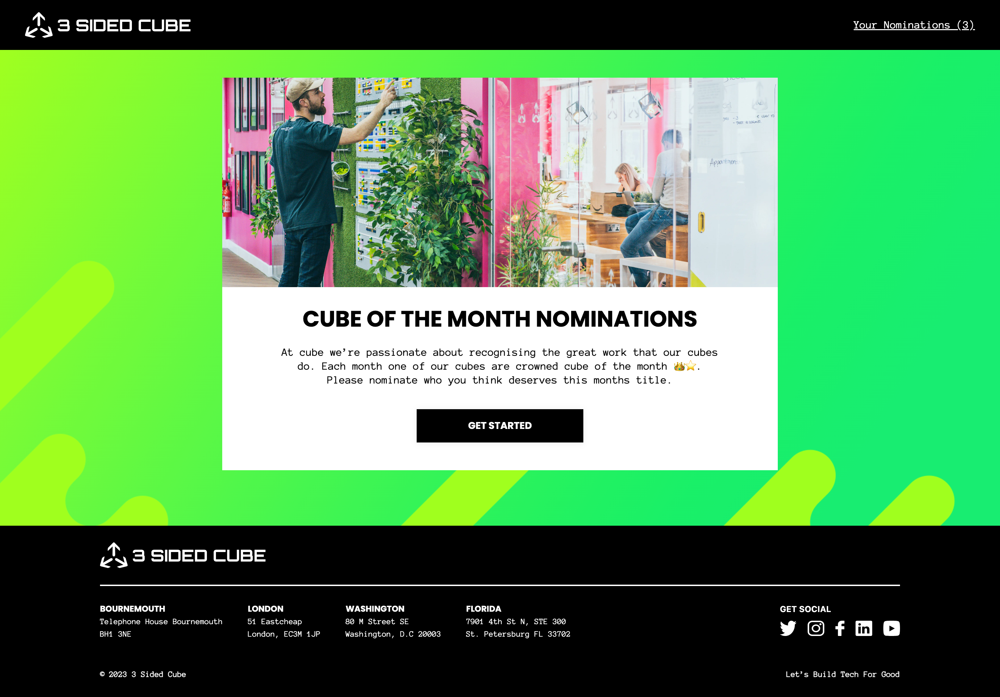

# 3SC Web Developer Task - My Submission

## Description

This project is a front-end implementation for a 'cube of the month' nomination system, built as part of the Cube Academy's web developer task. Utilizing Next.js 13 (App router), Tailwind CSS, React Hook Form, yup validation, and TypeScript, it aims to closely mirror the provided Figma designs. The application includes a register page and uses cookies for authentication.

## Installation

- Clone the repository.
- Run `npm install` to install dependencies.
- Use `npm run dev` to start the development server.
- or use `npm run build && npm start` to start and run the production server.

## Technologies Used

- **Next.js 13 (App Router)** : Used for the overall framework and routing of the application.
- **Tailwind CSS** : For styling and implementing responsive design.
- **React Hook Form with Yup Validation** : Managed form handling and validation.
- **TypeScript** : The primary programming language for type-safe code.
- **Axios** : Utilized for making HTTP requests to the API.
- **Shadcn UI** : A Radix-based UI component library coupled with tailwind to build the components.
- **React-Toastify** : For displaying user-friendly notifications and alerts.

## Challenges & Solutions

- **Time overestimation**: I decided to do the full task (7 days). However, I realised given my schedule it was actually a bad idea. I decided to just thug it out and managed to pull through. The only downside is that I feel I could have written better code or implemented better practices if I wasn't so stubborn. (Don't worry, the codebase is still well-structured)
- **TypeScript Learning Curve**: As a newcomer to TypeScript, this was a huge learning phase for me. I started learning it a few months ago howevr this was the first big project that required me to actually be type-safe. I usually throw the 'any' keyword on anything I don't know but I decided not to use it a single time here (I did infer some types though).
- **API Integration**: Initially planned to on using the recommended open-api codegen hooks. However, I had already implemented my server-side data fectching and written my own appContext hook. I also didn't believe I had enough time/liberty to be learning a new stack on a project where I'm pressed for time. The generation however helped me in designing my type structure of my respones/requests and restructuring my hooks. I'd love to learn more about it though.
- **SVG's and Images**: Due to some issues with my current laptop, I have a limited amount of images(pngs and jpegs) I can download. In many instances, I had to just copy the svg code direclty and paste it. I did fix this issue but I couldn't abstract all svgs. So I apologize for any hardcode svg Icon you come across
- **Design Adherence**: First of all, I'd like to give huge props to the designer. The design was just beautiful. I did have some issues understanding some parts so I did make a few assumptions (I sent an email but never got a response 😔)

Overall, I had a blast working on this project! Diving into TypeScript and playing around with Next.js 13's new features was both challenging and rewarding. Creating a custom login page and experimenting with Shadcn UI brought in a lot of fun and learning.

This task was more than just a test for me; it was a journey packed with growth and excitement. I really hope to bring this energy and passion to Cube Academy's team. Fingers crossed and looking forward to possibly joining you guys soon! Last but not the least heres a comparison image:

_My homepage Screenshot_

_Figma Design Screenshot_

